# 秒杀系统

## 一、技术点介绍

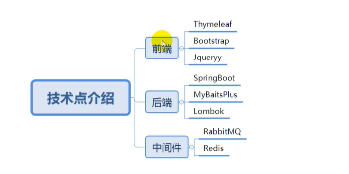

## 二、秒杀方案实现

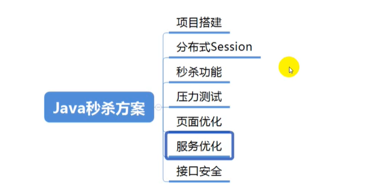

## 三、学习目标

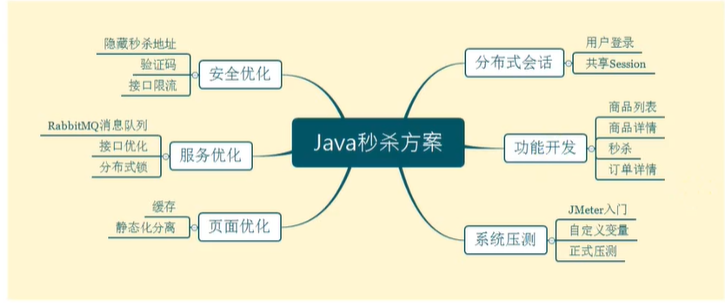

核心点：

* 通过 Redis 等缓存来对页面访问进行优化；
* RabbitMQ 进行异步下单，控制访问时机；
* 安全优化，解决黄牛抢票，简单的通过验证码和隐藏秒杀地址来实现。


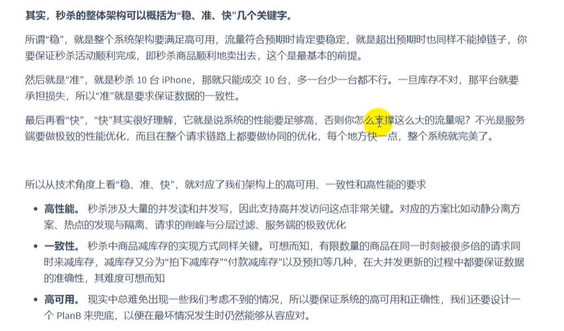


## 四、项目搭建

### 4.1 依赖引入

```xml
<!--md5 依赖-->
<dependency>
    <groupId>commons-codec</groupId>
    <artifactId>commons-codec</artifactId>
    <version>1.10</version>
</dependency>
<dependency>
    <groupId>org.apache.commons</groupId>
    <artifactId>commons-lang3</artifactId>
    <version>3.9</version>
</dependency>

<!-- validation组件,用于参数校验 -->
<dependency>
    <groupId>org.springframework.boot</groupId>
    <artifactId>spring-boot-starter-validation</artifactId>
</dependency>
```


### 4.2 SpringBoot核心文件配置

```yaml
spring:
   # thymeleaf配置
   thymeleaf:
     # 关闭缓存
     cache: false
   
   # 数据源配置
   datasource:
      driver-class-name: com.mysql.cj.jdbc.Driver
      url: jdbc:mysql://localhost:3306/seckill?useUnicode=true&characterEncoding=UTF-8&serverTimezone=Asia/Shanghai
      username: root
      password: xxxxxxx

   # 连接池配置    hikari被认为是当前最快的连接池
   hikari:
      # 连接池名
      pool-name: DateHikariCP
      # 最小空闲连接数
      minmum-idle: 5
      # 空闲连接最大存活时间（默认10分钟）
      idle-timeout: 1800000
      # 最大连接数（默认是10）
      maxmum-pool-size: 10
      # 从连接池返回的连接自动提交
      auto-commit: true
      # 连接最大存活时间（为0表示永久存活，默认30分钟）
      max-lifetime: 1800000
      # 连接超时时间（默认30秒）
      connection-timeout: 30000
      # 心跳机制测试连接是否可用
      connection-test-query: SELECT 1
      
# MyBatis-plus配置
 mybatis-plus:
    # 配置Mapper.xml 配置文件的位置
    mapper-locations: classpath*:/mapper/*Mapper.xml
    # 配置Mybatis数据返回类型别名
    type-aliases-package: com.xxx.seckill.pojo
    
# Mybatis SQL打印（方法接口所在的包，不是Mapper.xml所在的包）
 logging:
    level:
       com.xxx.seckill.mapper: debug
```


### 4.3 数据库创建

* 用户表

```sql
CREATE TABLE if not exists `t_user`(
   `id` BIGINT(20) NOT NULL COMMENT '用户ID--手机号码',
   `nickname` varchar(255) NOT NULL,
   `password` varchar(32) DEFAULT NULL COMMENT 'MD5(MD5(password明文+salt)+salt)两次加密',
   `salt` varchar(10) DEFAULT NULL,
   `head` varchar(128) DEFAULT NULL COMMENT '头像',
   `register_date` datetime DEFAULT NULL COMMENT '注册时间',
   `last_login_date` datetime DEFAULT NULL COMMENT '最后一次登录时间',
   `login_count` DEFAULT '0' COMMENT '登录次数',
   PRIMARY KEY(`id`)
)ENGINE=INNODB DEFAULT charset=utf8
```

**问：为什么要进行两次MD5加密？**

第一次在前端用户输入密码后进行加密，第二次在后端密码存储进数据库之前再进行一次加密。

第一次加密是为了保证数据在网络中传输时即使被截获也不会产生影响；第二次加密是为了防止数据库被盗取后根据盐和密码反推出真实密码。


### 4.4 Redis 集成优化

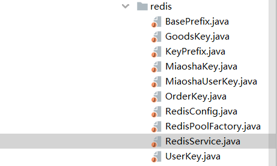

有多种Redis连接池可供选择，项目中我选择的是`lettuce`连接池，这里介绍下如何封装`jedis`连接池。

* **引入依赖**

```xml
	<dependency>
	    <groupId>redis.clients</groupId>
	    <artifactId>jedis</artifactId>
	</dependency>
```

* **连接池配置文件 redis.properties**

```properties
redis.host = xxxxx
redis.port = 6379
redis.timeout = 10    #单位是秒
redis.password = xxxxx
redis.poolMaxTotal = 1000
redis.poolMaxIdle = 500
redis.poolMaxWait = 500
```

* **Redis配置类 RedisConfig**

```java
@Configuration
@ConfigurationProperties(prefix = "redis")
public class RedisConfig {
	private String host;
	private int port;
	private int timeout;//秒
	private String password;
	private int poolMaxTotal;
	private int poolMaxIdle;
	private int poolMaxWait;//秒
	public String getHost() {
		return host;
	}
	public void setHost(String host) {
		this.host = host;
	}
	public int getPort() {
		return port;
	}
	public void setPort(int port) {
		this.port = port;
	}
	public int getTimeout() {
		return timeout;
	}
	public void setTimeout(int timeout) {
		this.timeout = timeout;
	}
	public String getPassword() {
		return password;
	}
	public void setPassword(String password) {
		this.password = password;
	}
	public int getPoolMaxTotal() {
		return poolMaxTotal;
	}
	public void setPoolMaxTotal(int poolMaxTotal) {
		this.poolMaxTotal = poolMaxTotal;
	}
	public int getPoolMaxIdle() {
		return poolMaxIdle;
	}
	public void setPoolMaxIdle(int poolMaxIdle) {
		this.poolMaxIdle = poolMaxIdle;
	}
	public int getPoolMaxWait() {
		return poolMaxWait;
	}
	public void setPoolMaxWait(int poolMaxWait) {
		this.poolMaxWait = poolMaxWait;
	}
}
```

* **连接池工厂**

```java
@Service
public class RedisPoolFactory{
   @Autowried
   RedisConfig redisConfig;
  
   @Bean
   public JedisPool JedisPoolFactory(){
       JedisPoolConfg poolConfig = new JedisPoolConfig();
       poolConfig.setMaxIdle(redisConfig.getPoolMaxIdle());
		   poolConfig.setMaxTotal(redisConfig.getPoolMaxTotal());
		   poolConfig.setMaxWaitMillis(redisConfig.getPoolMaxWait() * 1000);  //注意这里设置的是毫秒
		  JedisPool jp = new JedisPool(poolConfig, redisConfig.getHost(), redisConfig.getPort(),
				redisConfig.getTimeout()*1000, redisConfig.getPassword(), 0);
      return jp;
   }
}
```

> 基本配置准备好后，剩下的就是对于 Redis常用操作的封装，这里遵从模板设计模式来设计键值对的键。
>
> 接口用来定义一些公共方法，抽象类定义基础行为，实现类定义特有方法。

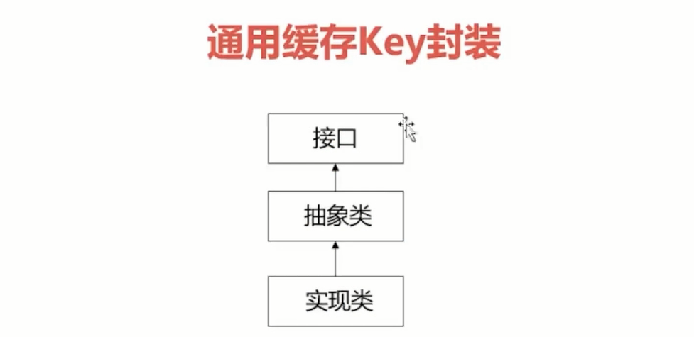

```java
//公共接口，定义了过期时间、前缀获取
public interface KeyPrefix{
    public int expireSeconds();
    
    public String getPrefix();
}


//抽象类实现了接口
public abstract class BasePrefix implements KeyPrefix{
	
	private int expireSeconds;
	
	private String prefix;
	
	public BasePrefix(String prefix) {//0代表永不过期
		this(0, prefix);
	}
	
	public BasePrefix( int expireSeconds, String prefix) {
		this.expireSeconds = expireSeconds;
		this.prefix = prefix;
	}
	
	public int expireSeconds() {//默认0代表永不过期
		return expireSeconds;
	}
  
  //不同的子类获取到的前缀不同，和子类名相关
	public String getPrefix() {
		String className = getClass().getSimpleName();
		return className+":" + prefix;
	}
}


//UserKey 用户类键值
public class UserKey extends BasePrefix{

	private UserKey(String prefix) {
		super(prefix);
	}
	public static UserKey getById = new UserKey("id");
	public static UserKey getByName = new UserKey("name");
}
```

举例：  比如一个`id`值为1的用户，他对应的Redis存储键值对为： `UserKey:id1`


* **常用方法封装**

```java
@Service
public class RedisService {
	
	@Autowired
	JedisPool jedisPool;
  
  //value   多种类型转化为字符串
  public static <T> String beanToString(T value){
     if(value == null)
        return null;
     Class<?> clazz = value.getClass();
     if(clazz==int.class || clazz==Integer.class)
        return ""+value;
     else if(clazz == String.class)
        return (String)value;
     else if(clazz==long.class || clazz==Long.class)
        return ""+value;
     else
        return JSON.toJSONString(value);
  }
  
  //value  字符串转化为实体类型
  public static <T> T stringToBean(String str, Class<T> clazz){
     if(str==null || str.length()<=0 || clazz==null){
        return null;
     }
     if(clazz==int.class || clazz==Integer.class)
        return (T)Integer.valueOf(str);
     else if(clazz == String.class)
        return str;
     else if(clazz==long.class || clazz==Long.class)
        return Long.valueOf(str);
     else
        return JSON.toJavaObject(JSON.parseObject(str),clazz);
  }
  
  //get
  public <T> T get(KeyPrefix prefix, String key, Class<T> clazz){
    try{
       Jedis jedis=null;
       jedis = jedisPool.getResource();
       String realKey = prefix.getPrefix()+key;
       String str = jedis.get(realKey);
       T t = stringToBean(str,clazz);
       return t;
    } finally{
       returnToPool(jedis);
    }
  }
  
  //set
  public <T> boolean set(KeyPrefix prefix, String key, T value){
       Jedis jedis = null;
       try{
           jedis = jedisPool.getResource();
           String str = beanToString(value);
           if(str==null || str.length()<=0)
              return false;
           String realKey = prefix.getPrefix()+key;
           int seconds = prefix.expireSeconds();
           if(seconds <= 0)
              jedis.set(realKey,str);
           else{
              jedis.setex(realKey, seconds, str);
           }
           return true;
       } finally {
           returnToPool(jedis);
       }
  }

  //hasKey
  public boolean exists(KeyPrefix prefix, String key){
     Jedis jedis = null;
     try{
        jedis = jedisPool.getResource();
        String realKey = prefix.getPrefix()+key;
        return jedis.exists(realKey);
     } finally{
        returnToPool(jedis);
     }
  }
  
  //delete
  public boolean delete(KeyPrefix prefix, String key){
     Jedis jedis = null;
     try{
        jedis = jedisPool.getResource();
        String realKey = prefix.getPrefix()+key;
        long ret = jedis.del(realKey);
        return ret>0?true:false;
     } finally{
        returnToPool(jedis);
     }
  }
}
```


## 五、基础注册功能

### 5.1   两次MD5加密设计

> https://segmentfault.com/a/1190000021009668

**前端加密：**

​         使用 JQuery md5加密：`https://github.com/emn178/js-md5`

```js
//在前端声明一个固定的盐值
var g_password_salt = "ewn576ifa12";


//登录JS方法中加密然后调用 ajax，加密时不全部使用salt，仅仅使用部分
function doLogin(){
    var inputPass = $("#password").val();
    var salt = g_passsword_salt;
    //使用盐中5位组合md5加密
    var str = ""+salt.charAt(0) + salt.charAt(2) + salt.charAt(5) + inputPass + salt.charAt(7) + salt.charAt(8);
    var password = md5(str);
    //使用第一次加密的密码进行ajax传输
    $.ajax({
        url: "/login/do_login",
        type: "POST",
        data:{
            mobile:$("#mobile").val(),
            password: password
        },
        //成功回调函数
        success:function(data){
            layer.closeAll();
            if(data.code == 2000){
                layer.msg("成功");
                window.location.href="/goods/to_list";
            }else{
                layer.msg(data.msg);
            }
        },
        //失败回调函数
        error:function(){
            layer.closeAll();
        }
    });
}
```


**后端加密：**

​         后端将拿到第一次md5加密的结果，这个密码就是表单提交上来的密码，我们需要在后端编写第二道md5加密方式来加密表单传来的密码后再与数据库存储的两次md5加密的密码进行比较，相同才能登陆成功。

​         第二次加密作用：因为第一次前端加密的密码有可能被窃取的，也可能解析我们的js看到我们前端加密方式，可以直接得到明文密码，所以我们需要第二次后端加密再存储，这样即使前端密码被拿到了后端的也不符合。

```java
public class MD5Util {
    public static String md5(String t){
        return DigestUtils.md5Hex(t);
    }

    private static final String salt = "ewn576ifa12";
//前端输入的密码到表单提交的密码(第一次加密) 用于校验前端传入的密码与该方法返回的密码是否相等
    public static String inputPassToFormPass(String pass){
        String s = "" + salt.charAt(0) + salt.charAt(2) + salt.charAt(5) + pass + salt.charAt(7) + salt.charAt(8);
        return md5(s);
    }
//表单提交的密码(第一次加密的密码)到数据库存储的密码(第二次加密)
    public static String formPassToDb(String formPass,String salt){
        String s = "" + salt.charAt(0) + salt.charAt(2) + salt.charAt(5) + formPass + salt.charAt(7) + salt.charAt(8);
        return md5(s);
    }
//前端输入的明文密码到数据库存储的密码 可用于注册
    public static String inputPassToDbPass(String input,String salt){
        String form = inputPassToFormPass(input);
        return formPassToDb(form,salt);
    }
}


//模拟登录业务测试
public boolean login(HttpServletResponse response,String mobile, String formPass) {
    //根据手机号获取User用户对象
        User user = UserMapper.getById(Long.parseLong(mobile));
        if(user==null){
            throw new GlobalException(ErrorCodeEnum.MOBILE_NOT_EXIST);//抛出自定义异常
        }
        String dbPass = user.getPassword();//获取数据库的第二次加密的密码
        String dbSalt = user.getSalt();//获取后端存储的盐
        String calPass = MD5Util.formPassToDb(formPass,dbSalt);//根据前端表单传来的密码计算出第二次加密结果
        if(!calPass.equals(dbPass)){//如果不相等
            log.error("{}登录密码错误",mobile);
            throw new GlobalException(ErrorCodeEnum.LOGIN_FAIL);
        }
        return true;
}
```


### 5.2 MyBatis-plus 逆向生成(推荐单独作为一个项目,使用时修改参数即可)

* 依赖引入

```xml
<!--添加代码生成的依赖-->
<dependency>
    <groupId>com.baomidou</groupId>
    <artifactId>mybatis-plus-generator</artifactId>
    <version>3.4.2</version>
</dependency>

<dependency>
    <groupId>org.freemarker</groupId>
    <artifactId>freemarker</artifactId>
    <version>2.3.31</version>
</dependency>
```

* 生成工具

```java
public class CodeGenerator {

    /**
     * <p>
     * 读取控制台内容
     * </p>
     */
    public static String scanner(String tip) {
        Scanner scanner = new Scanner(System.in);
        StringBuilder help = new StringBuilder();
        help.append("请输入" + tip + "：");
        System.out.println(help.toString());
        if (scanner.hasNext()) {
            String ipt = scanner.next();
            if (StringUtils.isNotBlank(ipt)) {
                return ipt;
            }
        }
        throw new MybatisPlusException("请输入正确的" + tip + "！");
    }

    public static void main(String[] args) {
        // 代码生成器
        AutoGenerator mpg = new AutoGenerator();

        // 全局配置
        GlobalConfig gc = new GlobalConfig();
        String projectPath = System.getProperty("user.dir");
        gc.setOutputDir(projectPath + "/src/main/java");
        // 作者
        gc.setAuthor("jobob");
        // 打开输出目录
        gc.setOpen(false);
        // xml开启 BaseResultMap
        gc.setBaseResultMap(true);
        // xml开启 BaseColumnList
        gc.setBaseColumnList(true);
        // 日期格式，采用Date
        gc.setDateType(DateType.DNLY_DATE);
        mpg.setGlobalConfig(gc);

        // 数据源配置
        DataSourceConfig dsc = new DataSourceConfig();
        dsc.setUrl("jdbc:mysql://localhost:3306/seckill?useUnicode=true&useSSL=false&characterEncoding=utf8&serverTimezone=Asia/Shanghai");
        // dsc.setSchemaName("public");
        dsc.setDriverName("com.mysql.cj.jdbc.Driver");
        dsc.setUsername("root");
        dsc.setPassword("密码");
        mpg.setDataSource(dsc);

        // 包配置
        PackageConfig pc = new PackageConfig();
        pc.setParent("com.xxxx.seckill")
          .setEntity("pojo")
          .setMapper("mapper")
          .setService("service")
          .setServiceImpl("service.impl")
          .setController("controller");
        mpg.setPackageInfo(pc);

        // 自定义配置
        InjectionConfig cfg = new InjectionConfig() {
            @Override
            public void initMap() {
                // to do nothing
            }
        };

        // 如果模板引擎是 freemarker
        String templatePath = "/templates/mapper.xml.ftl";
        // 如果模板引擎是 velocity
        // String templatePath = "/templates/mapper.xml.vm";

        // 自定义输出配置
        List<FileOutConfig> focList = new ArrayList<>();
        // 自定义配置会被优先输出
        focList.add(new FileOutConfig(templatePath) {
            @Override
            public String outputFile(TableInfo tableInfo) {
                // 自定义输出文件名 ， 如果你 Entity 设置了前后缀、此处注意 xml 的名称会跟着发生变化！！
                return projectPath + "/src/main/resources/mapper/" + pc.getModuleName()
                        + "/" + tableInfo.getEntityName() + "Mapper" + StringPool.DOT_XML;
            }
        });
        cfg.setFileOutConfigList(focList);
        mpg.setCfg(cfg);

        // 配置模板
        TemplateConfig templateConfig = new TemplateConfig();

        // 配置自定义输出模板
        //指定自定义模板路径，注意不要带上.ftl/.vm, 会根据使用的模板引擎自动识别
        // templateConfig.setEntity("templates/entity2.java");
        // templateConfig.setService();
        // templateConfig.setController();

        templateConfig.setXml(null);
        mpg.setTemplate(templateConfig);

        // 策略配置
        StrategyConfig strategy = new StrategyConfig();
        // 数据库表映射到实体的命名策略
        strategy.setNaming(NamingStrategy.underline_to_camel);
        // 数据库表字段映射到实体的命名策略
        strategy.setColumnNaming(NamingStrategy.underline_to_camel);
        // 实体是否使用lombok注解
        strategy.setEntityLombokModel(true);
        // 生成@RestController 控制器
        // strategy.setRestControllerStyle(true);
        
        // 一次性生成数据库中的多张表，通过 , 分隔开
        strategy.setInclude(scanner("表名，多个英文逗号分割").split(","));
        strategy.setControllerMappingHyphenStyle(true);
        // 去除掉表前缀，比如说表名为t_user，生成的类就为User
        strategy.setTablePrefix(pc.getModuleName() + "_");
        mpg.setStrategy(strategy);
        mpg.setTemplateEngine(new FreemarkerTemplateEngine());
        mpg.execute();
    }

}
```


### 5.3 参数校验优化

> https://blog.csdn.net/xjy9266/article/details/81150755

后端会接收到前端传过来的参数，同时要对参数格式进行校验然后才能进行处理。由于这写操作可能会被多次用到，那么应该与业务代码解耦，因此可以使用自定义注解来实现。

* **自定义注解**

```java
//这里举例编写自定义的验证手机号码的注解

@Target({METHOD,FIELD,ANNOTATION_TYPE,CONSTRUCTOR,PARAMETER,TYPE_USE})
@Retention(RUNTIME)
@Documented
@Constraint(validateBy = {IsMobileValidator.class})   //这里放置自定义校验类
public @interface isMobile{
    boolean required() default true;
    String message() default "手机号码格式错误";
    Class<?>[] groups() default {};
    Class<? extends Payload>[] payload() default{ };
}
```

* **自定义规则**

```java
// 自定义手机号码校验类---实现ConstraintValidator<K,V>泛型接口
public class IsMobileValidator implements ConstraintValidator<IsMobile,String>{
    public boolean required = false;
  
    @Override
    public void initialize(IsMobile constraintAnnotation){
       required = constraintAnnotation.required();
    }
  
    @Override
    public boolean isValid(String value, ConstraintValidatorContext context){
       if(required){
          return ValidatorUtil.isMobile(value);
       }
       else{
          if(StringUtils.isEmpty(value))
              return true;
          else
              return ValidatorUtil.isMobile(value);
       }
    }
}
```

* **校验工具类**

```java
// 校验工具类
public class ValidatorUtil{
  
    // 合格手机格式 Pattern
    private static final Pattern mobile_pattern = Pattern.compile("[1]([3-9])[0-9]{9}$");
    // 校验是否是手机格式
    public static boolean isMobile(String mobile){
        if(StringUtils.isEmpty(mobile))
           return false;
        Matcher matcher = mobile_pattern.matcher(mobile);
        return matcher.matches();
    }
}
```

定义完成后就能够将这个注解放在实体类的属性上进行注释了。


### 5.4 全局异常处理

> https://www.cnblogs.com/xuwujing/p/10933082.html

* **自定义错误接口**

```java
public interface BaseErrorInfoInterface{
    //错误码
    String getResultCode();
    
    //错误信息
    String getResultMsg();
}
```

* **自定义结果枚举**

```java
public enum CommonEnum implements BaseErrorInfoInterface{
     //通用
     SUCCESS(200,"SUCCESS"),
     ERROR(500,"服务器端异常"),
     
     //登录模块
     LOGIN_ERROR(500210,"用户名或密码错误"),
     MOBILE_ERROR(500211,"手机号码格式错误"),
     BIND_ERROR(500212,"参数校验错误");
  

    /** 错误码 */
    private String resultCode;

    /** 错误描述 */
    private String resultMsg;

    CommonEnum(String resultCode, String resultMsg) {
      this.resultCode = resultCode;
      this.resultMsg = resultMsg;
    }

    @Override
    public String getResultCode() {
      return resultCode;
    }

    @Override
    public String getResultMsg() {
      return resultMsg;
    }
}
```

* **自定义全局异常**

```java
public class GlobalException extends RuntimeException{
     protected String errorCode;
     protected String errorMsg;
  
     public GlobalException(BaseErrorInfoInterface error){
         this.errorCode = error.getResultCode();
         this.errorMsg = error.getResultMsg();
     }
  
     public BizException(String errorMsg) {
         this.errorMsg = errorMsg;
     }
	
     public BizException(String errorCode, String errorMsg) {
         this.errorCode = errorCode;
         this.errorMsg = errorMsg;
     }
  
     public String getErrorCode() {
        return errorCode;
     }

     public void setErrorCode(String errorCode) {
        this.errorCode = errorCode;
     }

     public String getErrorMsg() {
        return errorMsg;
     }

     public void setErrorMsg(String errorMsg) {
        this.errorMsg = errorMsg;
     }
}
```

* **自定义全局异常处理类**

```java
@RestControllerAdvice
public class GlobalExceptionHandler{
  
    @ExceptionHandler(Exception.class)
    public ResultObj ExceptionHandler(Exception e){
         // 如果是自定义全局异常类型
         if(e instanceof GlobalException){
             GlobalException ex = (GlobalException) e;
             return ResultObj.error(ex.getErrorCode+":"+ex.getErrorMsg);
         }
         // 如果是Validation参数校验异常，获取异常详细信息进行处理显示
         else if(e instanceof BindException){
             BindException ex = (BindException) e;
             String msg = ex.getBindingResult().getAllErrors().get(0).getDefaultMessage();
             ResultObj res = ResultObj.error(ex.getErrorCode,msg);
             return res;
         }
         return ResultObj.error();
    }
}
```


### 5.5 记录一个遇到的错误（406）

406是由于服务端返回的数据格式与客户端需要的数据格式不符导致的，比如说客户端要求返回 application/json 的数据格式而服务端返回的是 text/html  ，当然会出现问题。

解决办法：一般服务端与客户端的交互数据格式都是 json，因此引入使对象转化为 json 的依赖包，比如 `jackson`、`fastjson`等等。

#### ①Jackson 使用简介：

> ObjectMapper使用：  https://www.cnblogs.com/xuwenjin/p/8976696.html

依赖引入

```xml
        <dependency>
            <groupId>com.fasterxml.jackson.core</groupId>
            <artifactId>jackson-databind</artifactId>
            <version>2.12.2</version>
        </dependency>
        <dependency>
            <groupId>com.fasterxml.jackson.core</groupId>
            <artifactId>jackson-core</artifactId>
            <version>2.12.2</version>
        </dependency>
        <dependency>
            <groupId>com.fasterxml.jackson.core</groupId>
            <artifactId>jackson-annotations</artifactId>
            <version>2.12.2</version>
        </dependency>
```

ObjectMapper 简单配置

```java
public class JsonUtils{
  private static ObjectMapper mapper = new ObjectMapper();
  
  static{
      //对于空对象转json时不报错
      mapper.disable(SerializationFeature.FAIL_ON_EMPTY_BEANS);
      //设置忽略在json字符串中存在但是在java对象实际没有的属性
      mapper.disable(DeserializationFeature.FAIL_ON_UNKNOWN_PROPERTIES);
  }
  
  //序列化，将对象转化为json字符串
  public static String toJsonString(Object data){
       if(data == null){
          return null;
       }
       String json = null;
       json = mapper.writeValueAsString(data);
       return json;
  }
  
  //序列化，将json字符串转化为对象
  public <T> T parse(String json,Class<T> clazz){
     T t = null;
     t = mapper.readValue(json,clazz);
     return t;
  }
}
```

常用注解

`@JsonProperty`：类似于sql中的别名，用于序列化，使用注解字段属性，替代原字段属性。

```java
@JsonProperty("userName")
private String name;

实际序列化结果：  {"userName":xxxx}
```


`@JsonIgnore`：在序列化时忽略此字段

```java
public class User {
    @JsonIgnore
    private Long id;
    @JsonProperty("userName")
    private String name;
    @JsonIgnore
    private Integer age;
    @JsonIgnore
    private Date birthday;
}

实际序列化结果：{"userName":xxxx}
```


`@JsonFormat`：格式化日期格式

```java
public class User {
    private Long id;
    @JsonProperty("userName")
    private String name;
    private Integer age;
    @JsonFormat(pattern = "yyyy-MM-dd HH:mm:ss:SSS", timezone = "GMT+8")
    private Date birthday;
}

实际序列化结果：{"id":1,"age":23,"birthday":"2020-04-26 17:09:32:818","userName":"tom"}
```


### 5.6 Redis序列化Java8中的LocalDateTime错误

LocalDate、LocalTime、LocalDateTime 三者都是线程安全的类，相对比线程不安全的 SimpleDateFormat而言，更加实用。

> 为什么建议使用 LocalDateTime?  https://blog.csdn.net/weixin_38405253/article/details/100765007

程序中从Redis中反序列化取数据是对 RedisTemplate<String,Object> 进行了配置，如下：

```java
@Bean
	public RedisTemplate<String, Object> redisTemplate(RedisConnectionFactory redisConnectionFactory) {
		Jackson2JsonRedisSerializer<Object> jackson2JsonRedisSerializer = new Jackson2JsonRedisSerializer<Object>(Object.class);
		ObjectMapper om = new ObjectMapper();
		om.setVisibility(PropertyAccessor.ALL, JsonAutoDetect.Visibility.ANY);
		om.enableDefaultTyping(ObjectMapper.DefaultTyping.NON_FINAL);
		jackson2JsonRedisSerializer.setObjectMapper(om);
		RedisTemplate<String, Object> template = new RedisTemplate<String, Object>();
		template.setConnectionFactory(redisConnectionFactory);
		template.setKeySerializer(jackson2JsonRedisSerializer);
		template.setValueSerializer(jackson2JsonRedisSerializer);
		template.setHashKeySerializer(jackson2JsonRedisSerializer);
		template.setHashValueSerializer(jackson2JsonRedisSerializer);
		template.afterPropertiesSet();
		return template;
	}
```

但是无法处理 LocalDateTime 这样类型的数据，会报错`org.springframework.data.redis.serializer.SerializationException: Could not read JSON`，因

此解决办法是在 LocalDateTime 修饰的字段属性上指定序列化和反序列化器：

```java
    /**
     * 注册时间
     */
    @JsonFormat(shape = JsonFormat.Shape.STRING, pattern="yyyy-MM-dd HH:mm:ss",timezone = "GMT+8")
    @JsonSerialize(using = LocalDateTimeSerializer.class)    //LocalDateTime类型序列化
    @JsonDeserialize(using = LocalDateTimeDeserializer.class)//LocalDateTime类型反序列化
    private LocalDateTime registerDate;

    /**
     * 最后一次登录时间
     */
    @JsonFormat(shape = JsonFormat.Shape.STRING, pattern="yyyy-MM-dd HH:mm:ss",timezone = "GMT+8")
    @JsonSerialize(using = LocalDateTimeSerializer.class)
    @JsonDeserialize(using = LocalDateTimeDeserializer.class)
    private LocalDateTime lastLoginDate;
```


### 5.7 SpringBoot后端接收或者返回前端 LocalDateTime 类型数据出现异常

错误说明：`org.springframework.http.converter.HttpMessageNotReadableException: JSON parse error: Cannot deserialize value of type java.time.LocalDateTime from String \"2020-02-15 22:13:15\": Failed to deserialize java.time.LocalDateTime: (java.time.format.DateTimeParseException) Text '2020-02-15 22:13:15' could not be parsed at index 10; nested exception is com.fasterxml.jackson.databind.exc.InvalidFormatException: Cannot deserialize value of type java.time.LocalDateTime from String \"2020-02-15 22:13:15\": Failed to deserialize java.time.LocalDateTime: (java.time.format.DateTimeParseException) Text '2020-02-15 22:13:15' could not be parsed at index 10\n at [Source: (PushbackInputStream); line: 1, column: 15]`

出现这种问题的原因就是 LocalDateTime 的默认时间格式是  **yyyy-MM-dd THH:mm:ss**，其中多了一个 T，因此会造成在接受或者返回数据时出现问题。

解决办法是对 LocalDateTime 格式进行配置：

服务端接收客户端的数据并且反序列化为 LocalDateTime格式数据；服务端序列化将数据流转化为 LocalDateTime格式然后返回给前端。

```java

@Configuration
public class LocalDateTimeConfiguration {
 
    @Value("${spring.jackson.date-format:yyyy-MM-dd HH:mm:ss}")
    private String pattern;
 
    @Bean
    public Jackson2ObjectMapperBuilderCustomizer jackson2ObjectMapperBuilderCustomizer() {
        return builder -> {
            DateTimeFormatter formatter = DateTimeFormatter.ofPattern(pattern);
 
            //返回时间数据序列化
            builder.serializerByType(LocalDateTime.class, new LocalDateTimeSerializer(formatter));
            //接收时间数据反序列化
            builder.deserializerByType(LocalDateTime.class, new LocalDateTimeDeserializer(formatter));
        };
    }
}
```


### 5.8 返回给前端的中文数据乱码

在主配置文件中配置：

```yaml
server:
  servlet:
    encoding:
      force: true
      charset: UTF-8
      enabled: true
```


## 六、分布式会话


### 6.1 分布式Session

只有登陆过的用户才能进行秒杀抢购，那么当用户登录成功后需要对用户状态 session 进行保存

session  单机情况下可以保存在服务端，但是如果是分布式项目就需要考虑到 session 在多台机器之间的共享问题了。

* **`CookieUtil`工具类**

```java

public final class CookieUtils {
 
	protected static final Logger logger = LoggerFactory.getLogger(CookieUtils.class);
 
	/**
	 * 得到Cookie的值, 不编码
	 * 
	 * @param request
	 * @param cookieName
	 * @return
	 */
	public static String getCookieValue(HttpServletRequest request, String cookieName) {
		return getCookieValue(request, cookieName, false);
	}
 
	/**
	 * 得到Cookie的值,
	 * 
	 * @param request
	 * @param cookieName
	 * @return
	 */
	public static String getCookieValue(HttpServletRequest request, String cookieName, boolean isDecoder) {
		Cookie[] cookieList = request.getCookies();
		if (cookieList == null || cookieName == null){
			return null;			
		}
		String retValue = null;
		try {
			for (int i = 0; i < cookieList.length; i++) {
				if (cookieList[i].getName().equals(cookieName)) {
					if (isDecoder) {
						retValue = URLDecoder.decode(cookieList[i].getValue(), "UTF-8");
					} else {
						retValue = cookieList[i].getValue();
					}
					break;
				}
			}
		} catch (UnsupportedEncodingException e) {
			logger.error("Cookie Decode Error.", e);
		}
		return retValue;
	}
 
	/**
	 * 得到Cookie的值,
	 * 
	 * @param request
	 * @param cookieName
	 * @return
	 */
	public static String getCookieValue(HttpServletRequest request, String cookieName, String encodeString) {
		Cookie[] cookieList = request.getCookies();
		if (cookieList == null || cookieName == null){
			return null;			
		}
		String retValue = null;
		try {
			for (int i = 0; i < cookieList.length; i++) {
				if (cookieList[i].getName().equals(cookieName)) {
					retValue = URLDecoder.decode(cookieList[i].getValue(), encodeString);
					break;
				}
			}
		} catch (UnsupportedEncodingException e) {
			logger.error("Cookie Decode Error.", e);
		}
		return retValue;
	}
 
	/**
	 * 设置Cookie的值 不设置生效时间默认浏览器关闭即失效,也不编码
	 */
	public static void setCookie(HttpServletRequest request, HttpServletResponse response, String cookieName, String cookieValue) {
		setCookie(request, response, cookieName, cookieValue, -1);
	}
 
	/**
	 * 设置Cookie的值 在指定时间内生效,但不编码
	 */
	public static void setCookie(HttpServletRequest request, HttpServletResponse response, String cookieName, String cookieValue, int cookieMaxage) {
		setCookie(request, response, cookieName, cookieValue, cookieMaxage, false);
	}
 
	/**
	 * 设置Cookie的值 不设置生效时间,但编码
	 */
	public static void setCookie(HttpServletRequest request, HttpServletResponse response, String cookieName, String cookieValue, boolean isEncode) {
		setCookie(request, response, cookieName, cookieValue, -1, isEncode);
	}
 
	/**
	 * 设置Cookie的值 在指定时间内生效, 编码参数
	 */
	public static void setCookie(HttpServletRequest request, HttpServletResponse response, String cookieName, String cookieValue, int cookieMaxage, boolean isEncode) {
		doSetCookie(request, response, cookieName, cookieValue, cookieMaxage, isEncode);
	}
 
	/**
	 * 设置Cookie的值 在指定时间内生效, 编码参数(指定编码)
	 */
	public static void setCookie(HttpServletRequest request, HttpServletResponse response, String cookieName, String cookieValue, int cookieMaxage, String encodeString) {
		doSetCookie(request, response, cookieName, cookieValue, cookieMaxage, encodeString);
	}
 
	/**
	 * 删除Cookie带cookie域名
	 */
	public static void deleteCookie(HttpServletRequest request, HttpServletResponse response, String cookieName) {
		doSetCookie(request, response, cookieName, "", -1, false);
	}
 
	/**
	 * 设置Cookie的值，并使其在指定时间内生效
	 * 
	 * @param cookieMaxage
	 *            cookie生效的最大秒数
	 */
	private static final void doSetCookie(HttpServletRequest request, HttpServletResponse response, String cookieName, String cookieValue, int cookieMaxage, boolean isEncode) {
		try {
			if (cookieValue == null) {
				cookieValue = "";
			} else if (isEncode) {
				cookieValue = URLEncoder.encode(cookieValue, "utf-8");
			}
			Cookie cookie = new Cookie(cookieName, cookieValue);
			if (cookieMaxage > 0)
				cookie.setMaxAge(cookieMaxage);
			if (null != request)// 设置域名的cookie
				cookie.setDomain(getDomainName(request));
			cookie.setPath("/");
			response.addCookie(cookie);
		} catch (Exception e) {
			logger.error("Cookie Encode Error.", e);
		}
	}
 
	/**
	 * 设置Cookie的值，并使其在指定时间内生效
	 * 
	 * @param cookieMaxage
	 *            cookie生效的最大秒数
	 */
	private static final void doSetCookie(HttpServletRequest request, HttpServletResponse response, String cookieName, String cookieValue, int cookieMaxage, String encodeString) {
		try {
			if (cookieValue == null) {
				cookieValue = "";
			} else {
				cookieValue = URLEncoder.encode(cookieValue, encodeString);
			}
			Cookie cookie = new Cookie(cookieName, cookieValue);
			if (cookieMaxage > 0)
				cookie.setMaxAge(cookieMaxage);
			if (null != request)// 设置域名的cookie
				cookie.setDomain(getDomainName(request));
			cookie.setPath("/");
			response.addCookie(cookie);
		} catch (Exception e) {
			logger.error("Cookie Encode Error.", e);
		}
	}
 
	/**
	 * 得到cookie的域名
	 */
	private static final String getDomainName(HttpServletRequest request) {
		String domainName = null;
 
		String serverName = request.getRequestURL().toString();
		if (serverName == null || serverName.equals("")) {
			domainName = "";
		} else {
			serverName = serverName.toLowerCase();
			serverName = serverName.substring(7);
			final int end = serverName.indexOf("/");
			serverName = serverName.substring(0, end);
			final String[] domains = serverName.split("\\.");
			int len = domains.length;
			if (len > 3) {
				// www.xxx.com.cn
				domainName = domains[len - 3] + "." + domains[len - 2] + "." + domains[len - 1];
			} else if (len <= 3 && len > 1) {
				// xxx.com or xxx.cn
				domainName = domains[len - 2] + "." + domains[len - 1];
			} else {
				domainName = serverName;
			}
		}
 
		if (domainName != null && domainName.indexOf(":") > 0) {
			String[] ary = domainName.split("\\:");
			domainName = ary[0];
		}
		return domainName;
	}
```

* **通过UUID随机生成cookie的值**

```java
// UUID 的工具类

public class UUIDUtils{
    public static String uuid(){
         return UUID.randomUUID().toString().replace("-","");
    }
}
```

* **单机登录业务处理，session只用存储在当前服务器上**

  在用户登录成功后，需要重新生成对应的  `cookie`的值，并且将该`cookie`存储到 `session`中，最后添加`cookie`到`response`中。

```java
//如果登录成功.....
String ticket = UUIDUtil.uuid();
//1.设置session中存储用户对象
request.getSession().setAttribute(ticket,user);
//2.设置cookie存储ticket(键)
CookieUtil.setCookie(request,response,"userTicket",ticket);
//成功返回
```


### 6.2 Redis 实现分布式 session

分布式情况下，在登录成功后用户的信息不再存放在服务端session中，而是保存到Redis中，之后需要获取用户信息就从Redis中获取。

* **依赖引入**

```xml
<!-- spring data redis 依赖-->
<dependency>
    <groupId>org.springframework.boot</groupId>
    <artifactId>spring-boot-starter-data-redis</artifactId>
</dependency>

<!-- commons-pool2 对象池依赖-->
<denpendency>
    <groupId>org.apache.commons</groupId>
    <artifactId>commons-pool2</artifactId>
</denpendency>

<!-- spring session依赖 -->
<denpendency>
    <groupId>org.springframework.boot</groupId>
    <artifactId>spring-session-data-redis</artifactId>
</denpendency>
```

* **redis及连接池配置**

```yaml
redis:
   host: 服务器地址
   port: 6379
   database: 0
   # 连接超时时间
   timeout: 10000
   
   # lettuce连接池
   lettuce:
      pool:
        # 最大连接数，默认为8
        max-active: 8
        # 最大连接阻塞等待时间，默认-1
        max-wait: 10000
        # 最大空闲连接，默认为8
        max-idle: 200
        # 最小空闲连接，默认8
        min-idle: 5
```

* **修改后的登录业务处理**

```java
// 如果登录成功...
// 将用户信息存储到Redis
redisTemplate.opsForValue("user:"+userTicket,user);
// 设置cookie
CookieUtil.setCookie(request,response,"userTicket",userTicket);
```


### 6.3 方法参数传递优化(SpringMVC接口)

在本项目中，只要用户成功登陆了网站那么就会生成对应的 `AccessToken`放入到请求头Header中的 `Authorization`中。以后的每次请求访问都需要在请求头中携带上`Authorization`进行身份核验。

但是这一块内容在很多方法中都需要用到，因此可以考虑将功能提取出一个切面(Aspect)。这里介绍一下另一种方法，是基于对SpringMVC接口进行重新实现。重写里面的`addArgumentResolvers()`方法，就可以根据Controller中方法请求的参数类型进行拦截判断然后进行相关处理。


```java
// 需要自定义 SpringMVC配置，因此创建 WebConfig类并实现 接口
@Configuration
@EnableWebMvc

public class WebConfig implements WebMvcConfigurer{
    @Autowired
    private UserArgumentResolver userResolver;
     
    //这个方法需要在集合中添加 HandlerMethodArgumentResolver(接口)类型的方法参数解析器
    @Override
    public void addArgumentResolvers(List<HandlerMethodArgumentResolver> resolvers){
       resolvers.add(userResolver);
    }
}
```


```java
// 具体参数过滤方法
@Component
public class UserArgumentResolver implements HandlerMethodArgumentResolver{
   @Autowired
   private IUserService userService;
  
   // 判断参数类型，只有该方法返回true才会往下继续执行
   @Override
   public boolean supportsParameter(MethodParameter parameter){
       Class<?> clazz = parameter.getParameterType();
       return clazz == User.class;
   }
  
   // 参数处理并返回
   @Override
   public Object resolveArgument(MethodParameter parameter, ModelAndViewContainer mavContainer, NativeWebRequest webRequest, WebDataBinderFactory binderFactory) throws Exception{
     //从请求头中获取出键为 Authorization的token值
     HttpServletRequest request = webRequest.getNativeRequest(HttpServletRequest.class);
     String token = "";
     // 获取头部信息
     Enumeration<String> headerNames = request.getHeaderNames();
     while (headerNames.hasMoreElements()) {
       String key = (String) headerNames.nextElement();
       String value = request.getHeader(key);
       if ("Authorization".equalsIgnoreCase(key)) {
         token = value;
       }
     }
     // 校验token
     if (StringUtils.isBlank(token)) {
         return new Result(ResultCode.PARAM_ERROR);
     }
     if (JwtUtil.verify(token)){
         String account = JwtUtil.getClaim(token, JwtConstant.ACCOUNT);
         if (StringUtils.isBlank(account)) {
           return new Result(ResultCode.NOT_LOGIN, "token失效或不正确.");
         }
     }
     // 根据account从Redis中获取实体数据信息
     return redisTemplate.opsForValue.get(account);
   }
}
```


```java
// 实际的方法使用中如果需要用到User实体信息，直接在方法参数列表中加上 User即可
public String toList(Model model,User user){
   xxxx....
}
```


### 6.4 分布式session心得总结

* **session复制：**

多台机器间进行session复制传输，优点是无须修改代码，只需要进行Tomcat的修改配置即可。缺点是传输时占用内网带宽，时延较大，而且占用内存。


* **Cookie + Redis：**

这是最简单的一种实现方式，不需要使用到session，客户端第一次登录成功后服务端会随机生成一个 Cookie值，并且生成`{cookie:user对象}`的键值对存储到 Redis 中。

由于 Cookie 存储在客户端，之后每次用户请求访问时都携带上这个 cookie；服务端只需要根据这个 cookie去从 Redis中取出用户实体的信息即可。

这种模式能够实现简易的无状态单点登录模型，但是安全性太差，如果在传输途中 cookie 被盗取，之后就能够根据 cookie 和 用户名进行违法操作。


* **JWT + Redis：**

> JWT、Token、Cookie、Session的区别：https://blog.csdn.net/wangzhipeng47/article/details/107867617
>
> JWT+Redis 实现无状态登录：https://www.doufuplus.com/blog/shiro-jwt01.html

Cookie 存储的数据量小而且不安全，更关键的是 Cookie不能实现跨域。

JWT 的出现无须再使用 session和cookie了，JWT内部能够存储一些重要的数据信息(前提是必须对JWT进行加密)，JWT也能够设置过期时间，安全性比较高。

实现方案：

   1. 用户第一次登录成功后，服务端会生成两个 token数据：`RefreshToken`、`AccessToken`。`AccessToken`是真正用来进行服务器和客户端交互传输的数据，在生成 AccessToken的过程中，需要在内部保存 `当前的用户名+当前登录时间戳`两个关键信息，这两个信息主要用于后面的认证处理，AccessToken的有效时间一般设置的比较短，5分钟左右比较合适，短时间的AccessToken进一步提高了安全性。其次AccessToken 还要使用 JWT 进行私钥（服务端持有）加密处理，这样保证生成的 Token 数据不会被轻易破解。服务端生成完毕后的 AccessToken 会发送给客户端，并且保存在客户端，之后每次 用户请求访问都需要在请求头(`Header`)中添加上 AccessToken。

      `RefreshToken`的主要功能是用来验证请求头中的token数据，并且在`AccessToken`过期时进行刷新处理。RefreshToken 是一个键值对的形式：`{account:登录时间戳}`，这个键值对保存在 Redis中。RefreshToken 的有效时间比 AccessToken 长，一般设置为30分钟。

      登录认证通过后返回`AccessToken`信息(在AccessToken中保存当前的时间戳和帐号)，同时在Redis中设置一条以帐号为Key，Value为当前时间戳(登录时间)的`RefreshToken`，现在认证时必须AccessToken没失效以及Redis存在所对应的RefreshToken，**且RefreshToken时间戳和AccessToken信息中时间戳一致**才算认证通过，这样可以做到JWT的可控性，如果重新登录获取了新的AccessToken，旧的AccessToken就认证不了，因为Redis中所存放的的RefreshToken时间戳信息只会和最新的AccessToken信息中携带的时间戳一致，这样每个用户就只能使用最新的AccessToken认证。

2. `RefreshToken`还可以用来判断用户是否在线，如果删除 Redis 中的某个 RefreshToken，那么对应的 AccessToken 就无法认证了，这样就相当于控制了用户的登录，可以剔除用户。

3. 本身`AccessToken`的过期时间为5分钟(配置文件可配置)，`RefreshToken`过期时间为30分钟(配置文件可配置)，当登录后时间过了5分钟之后，当前`AccessToken`便会过期失效，再次带上`AccessToken`访问JWT会抛出`TokenExpiredException`异常说明Token过期，开始判断是否要进行`AccessToken`刷新，首先redis查询`RefreshToken`是否存在，以及**时间戳和过期AccessToken所携带的时间戳是否一致**，如果存在且一致就进行AccessToken刷新。

   刷新后新的`AccessToken`过期时间依旧为5分钟(配置文件可配置)，时间戳为当前最新时间戳，同时也设置`RefreshToken`中的时间戳为当前最新时间戳，刷新过期时间重新为30分钟过期(配置文件可配置)，最终将刷新的`AccessToken`存放在Response的Header中的`Authorization`字段返回。

   同时前端进行替换，下次用新的 AccessToken进行访问即可。

4. 登录成功后的用户个人信息同样可以保存到Redis中方便下次取用，键为用户名，值为对象 user。


* **Cookie + JWT + Redis完美解决方案：**

方法二看起来已经非常完美了，但是它太依赖于第三方软件 Redis，如果 Redis宕机功能就无法实现。因此我们需要考虑怎么组合来使得 Cookie 和 JWT+Redis 两种方案能够相互切换。

> https://blog.csdn.net/sxiaobei/article/details/57086489


## 七、秒杀方法简单搭建

### 7.1 建表

商品表：

```sql
CREATE table if not exists `goods`(
   `id` BIGINT(20) NOT NULL AUTO_INCREMENT COMMENT '商品ID',
	 `goods_name` VARCHAR(16) DEFAULT NULL COMMENT '商品名称',
   `goods_title` 	VARCHAR(64) DEFAULT NULL COMMENT '商品标题',
   `goods_img` VARCHAR(64) DEFAULT NULL COMMENT '商品图片',
   `goods_detail` LONGTEXT COMMENT '商品详情',
   `goods_price` DECIMAL(10,2) DEFAULT '0.00' COMMENT '商品价格',
   `goods_stock` INT(11) DEFAULT '0' COMMENT '商品库存，-1表示没有限制',
		PRIMARY KEY(`id`)
)ENGINE=INNODB AUTO_INCREMENT=3 DEFAULT CHARSET=utf8;
```

订单表：

```java
CREATE TABLE IF NOT EXISTS `t_order`(
   `id` BIGINT(20) NOT NULL AUTO_INCREMENT COMMENT '订单ID',
   `user_id` BIGINT(20) DEFAULT NULL COMMENT '用户ID',
	 `goods_id` BIGINT(20) DEFAULT NULL COMMENT '商品ID',
   `delivery_addr_id` BIGINT(20) DEFAULT NULL COMMENT '收货地址ID',
   `goods_name` VARCHAR(16) DEFAULT NULL COMMENT '冗余过来的商品名称',
   `goods_count` INT(11) DEFAULT '0' COMMENT '商品数量',
   `goods_price` DECIMAL(10,2) DEFAULT '0.00' COMMENT '商品单价',
   `order_channel` TINYINT(4) DEFAULT '0' COMMENT '购买渠道,1pc,2android,3ios',
   `status` TINYINT(4) DEFAULT '0' COMMENT '订单状态：0新建未支付，1已支付，2已发货，3已收货，4已退款，5以完成',
   `create_date` datetime DEFAULT NULL COMMENT '下单时间',
   `pay_date` datetime DEFAULT NULL COMMENT '支付时间',
   PRIMARY KEY (`ID`)
)ENGINE=INNODB AUTO_INCREMENT=12 DEFAULT CHARSET=utf8;
```

秒杀商品表：

```sql
CREATE TABLE IF NOT EXISTS `t_seckill_goods`(
	`id` BIGINT(20) NOT NULL AUTO_INCREMENT COMMENT '秒杀商品ID',
  `goods_id` BIGINT(20) DEFAULT NULL COMMENT '商品ID',
  `seckill_price` DECIMAL(10,2) DEFAULT '0.00' COMMENT '秒杀价',
  `stock_count` INT(10) DEFAULT NULL COMMENT '库存容量',
  `start_date` datetime DEFAULT NULL COMMENT '秒杀开始时间',
  `end_date` datetime DEFAULT NULL COMMENT '秒杀结束时间',
	PRIMARY KEY(`id`)
)ENGINE=INNODB AUTO_INCREMENT=3 DEFAULT CHARSET=utf8;
```

秒杀订单表：

```sql
CREATE TABLE IF NOT EXISTS `t_seckill_order`(
   `id` BIGINT(20) NOT NULL AUTO_INCREMENT COMMENT '秒杀订单ID',
   `user_id` BIGINT(20) DEFAULT NULL COMMENT '用户ID',
   `order_id` BIGINT(20) DEFAULT NULL COMMENT '订单ID',
   `goods_id` BIGINT(20) DEFAULT NULL COMMENT '商品ID',
    PRIMARY KEY (`id`)
)ENGINE=INNODB AUTO_INCREMENT=3 DEFAULT CHARSET=utf8;
```

### 7.2 详细的秒杀逻辑见代码


## 八、Jmeter压测

### 8.1 Windows 下 Jmeter压测

首先到官网下载 JMeter文件包，解压后可以发现文件目录：

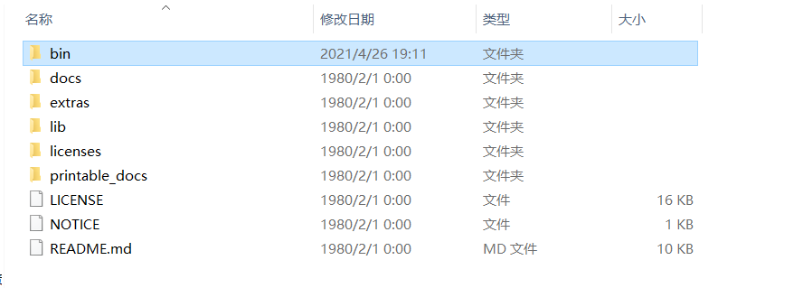

启动 bin 目录下的 `jmeter.sh` 文件。

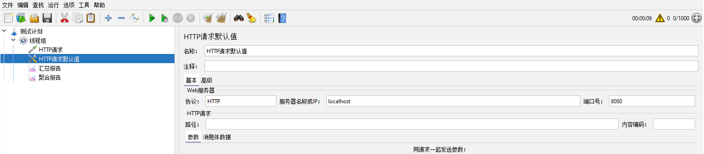

如图先添加线程组，在线程组下分别添加配置原件、取样器、监听器。

`配置原件`下的 `HTTP请求默认值`：用来配置请求的基本参数，包含协议、服务器IP地址、端口号

`取样器`：添加具体的 `HTTP请求`。

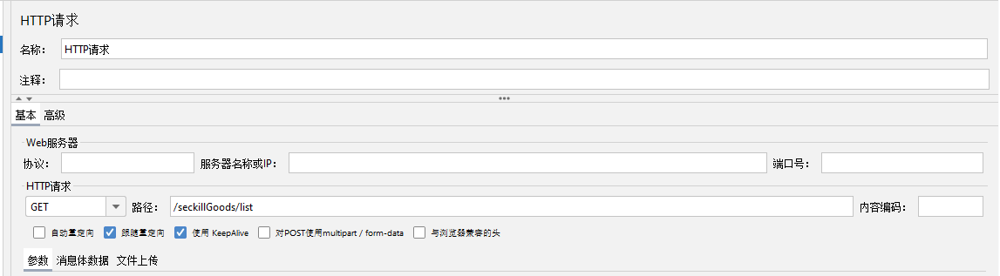

`监听器`：添加具体的汇总报告、聚合报告、结果树等。


### 8.2 Linux下进行Jmeter压测

先在Linux下安装Jmeter，到官网下载压缩文件后上传解压即可。

然后在Linux本次配置好请求的方案，运行一次后生成 `.jmx`类型的压测文件，将文件上传至Linux中 Jmeter下的 bin 目录下。

执行命令：`./jmeter -n -t first.jmx -l result.jtl` 执行压测。

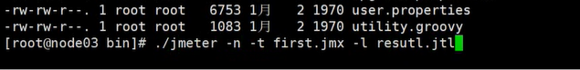

参数说明：`-n：`表示不使用图形界面；  `-t：`表示测试的文件   `-l：`表示存储执行结果的文件

最后将结果文件`result.jtl`下载到 Windows本地用 Jmeter工具打开查看。


### 8.3 压测方案

#### ①对商品列表进行压测处理

先在本地开启项目进行一次请求访问，由于不需要任何参数，直接在Jmeter中加上访问地址进行访问。

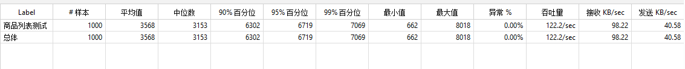


#### ②对同一用户进行多次压测处理

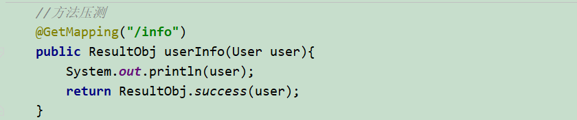

这个方法需要请求中携带的请求头`Authorization`，那么先用 postman 访问获取 token数据，然后在Jmeter中配置请求的请求头即可。

`配置元件中的 HTTP信息头管理器`：这个就是配置请求头的地方

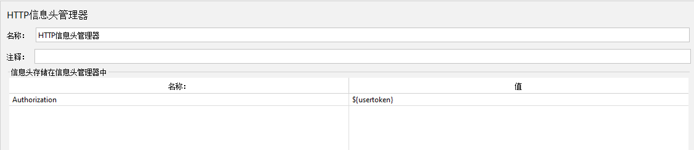


#### ③对不同用户进行多次压测处理(携带不同参数)

对于不同用户的压测就需要额外编写不同用户的配置文件信息，文件中包含不同用户的请求头中的 token

在本地创建一个配置文件`config.txt`，里面存放不同用户的 token 数据。

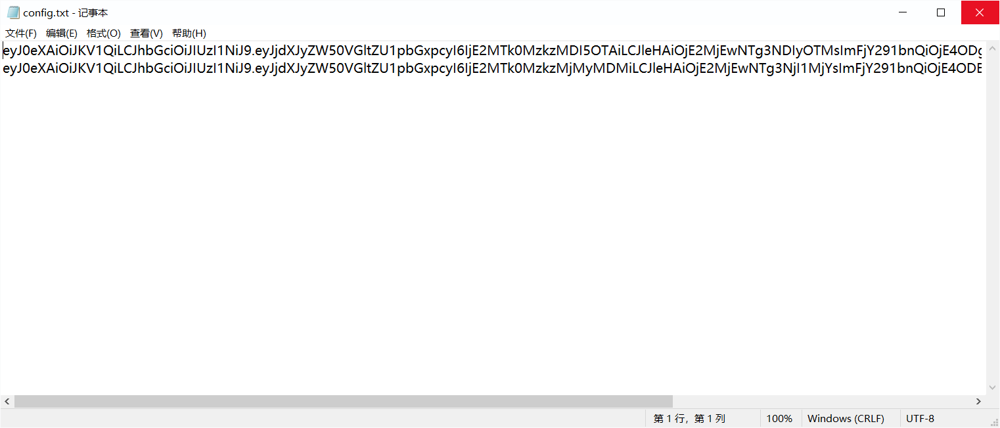

这里一个用户的数据位于一行，如果一个用户有多个需要配置的参数，之间用逗号分隔开。

然后到Jmeter中打开 `配置元件中的 CSV数据文件设置`

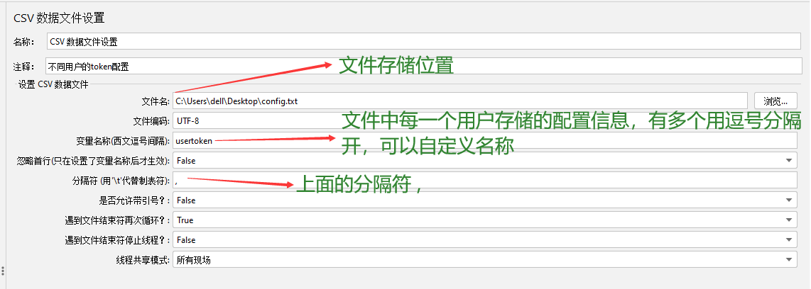

接下来就是对信息的配置，我这里由于数据是要加在请求头中的，因此在`HTTP信息头管理器`中进行参数配置

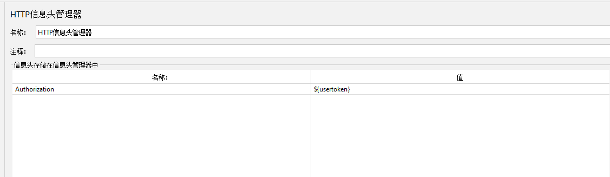

`${usertoken}`就用到了上面所声明的配置文件中的参数，配置完后就可以开始压测了。


### 8.4 JMeter压测数据生成

项目中压测数据通过一个工具类来生成。主要涉及了 jdbc连接数据库、文件流`RandomAccessFile`、模拟请求`HttpURLConnection`。

> LocalDateTime获取毫秒数：  https://cloud.tencent.com/developer/ask/49315
>
> RandomAccessFile详解：  https://www.jianshu.com/p/360e37539266
>
> HttpURLConnection详解：  https://zhuanlan.zhihu.com/p/90129592


#### HttpURLConnection：

> HttpURLConnection 是Java提供的发起 HTTP 请求的基础类库，提供了 HTTP请求的基础能力

**1. 发送POST请求**

```java
//获取连接
HttpURLConnection connection = (HttpURLConnection) new URL("http://localhost:8080/demo").openConnection();
//设置请求方式
connection.setRequestMethod("POST");
connection.setDoOutput(true);   //发送请求体需要

//设置请求头
connection.setRequestProperty("Content-Type","application/json");

//设置请求体
//先获取到连接的输出流，然后进行封装后进行写入操作
try(PrintWriter writer = new PrintWriter(connection.getOutputStream())){
   Map<String, String> foo = new HashMap<>();
   foo.put("name","jim");
   foo.put("age",18);
   writer.write(JSONObject.toJSONString(foo));
   writer.flush();
}

//获取响应---获取到输入流
try(BufferedReader reader = new BufferedReader(new InputStreamReader(connection.getInputStream()))){
  String line;
  while((line = reader.readLine()) != null){
     System.out.println(line);
  }
}finally{
   connection.close();
}
```

**2. 发送GET请求**

```java
//获取连接
HttpURLConnection connection = (HttpURLConnection) new URL("http://localhost:8080/demo").openConnection();
//设置GET请求方式
connection.setRequestMethod("GET");

//设置请求头
connection.setRequestProperty("Content-Type","application/json");

//设置连接超时时间
connection.setConnectTimeout(1000*5);
connection.setReadTimeout(1000*10);
//进行连接
connection.connect();

//获取结果
//获取状态码
int responseCode = connection.getResponseCode();
try(BufferedReader reader = new BufferedReader(new InputStreamReader(connection.getInputStream()))){
   String line;
   while((line = reader.readLine())!=null)
      System.out.println(line);
}finally{
   connection.close();
}
```

**核心API：**

* `setDoOutput(true)`：发送请求体需要
* `setRequestProperty`：设置请求头
* `getHeaderField`：获取请求头
* `setConnectTimeout`：设置连接超时
* `setReadTimeout`：设置读取超时
* `getResponseCode`：获取状态码


#### RandomAccessFile：

> RandomAccessFile 可以自由地向文件中写入和读取数据，同时支持随机访问，程序可以快速跳转到文件地任意地方开始读写数据。

如果不需要完整地读取文件，而只是读取部分文件，推荐使用 `RandomAccessFile`；

`RandomAccessFile`可以向已经存在的文件的末尾追加内容；

`RandomAccessFile`的一个重要应用场景就是多线程下载和断点续传。


**核心API：**

1. **构造函数**

包括两种构造函数：一个需要使用 String参数来指定文件名+写入格式`mode`，另一个需要使用 File参数指明文件+写入格式`mode`。

> **"r" : **   以只读方式打开。调用结果对象的任何 write 方法都将导致抛出 IOException。
>         **"rw":**    打开以便读取和写入。
>         **"rws":**  打开以便读取和写入。相对于 "rw"，"rws" 还要求对“文件的内容”或“元数据”的每个更新都同步写入到基础存储设备。
>         **"rwd" :**  打开以便读取和写入，相对于 "rw"，"rwd" 还要求对“文件的内容”的每个更新都同步写入到基础存储设备。

2. **重要方法**

`long getFilePointer()`：返回文件指针当前记录的位置

`void seek(long pos)`：调整指针的位置

3. **多线程下载文件实例**

预先将整个文件分成几个块，每个块分别用一个线程进行下载传输。

```java
/** 
 * 测试利用多线程进行文件的写操作 
 */  
public class Test {  
  
    public static void main(String[] args) throws Exception {  
        // 预分配文件所占的磁盘空间，磁盘中会创建一个指定大小的文件  
        RandomAccessFile raf = new RandomAccessFile("D://abc.txt", "rw");  
        raf.setLength(1024*1024); // 预分配 1M 的文件空间  
        raf.close();  
          
        // 所要写入的文件内容  
        String s1 = "第一个字符串";  
        String s2 = "第二个字符串";  
        String s3 = "第三个字符串";  
        String s4 = "第四个字符串";  
        String s5 = "第五个字符串";  
          
        // 利用多线程同时写入一个文件  
        new FileWriteThread(1024*1,s1.getBytes()).start(); // 从文件的1024字节之后开始写入数据  
        new FileWriteThread(1024*2,s2.getBytes()).start(); // 从文件的2048字节之后开始写入数据  
        new FileWriteThread(1024*3,s3.getBytes()).start(); // 从文件的3072字节之后开始写入数据  
        new FileWriteThread(1024*4,s4.getBytes()).start(); // 从文件的4096字节之后开始写入数据  
        new FileWriteThread(1024*5,s5.getBytes()).start(); // 从文件的5120字节之后开始写入数据  
    }  
      
    // 利用线程在文件的指定位置写入指定数据  
    static class FileWriteThread extends Thread{  
        private int skip;  
        private byte[] content;  
          
        public FileWriteThread(int skip,byte[] content){  
            this.skip = skip;  
            this.content = content;  
        }  
          
        public void run(){  
            RandomAccessFile raf = null;  
            try {  
                raf = new RandomAccessFile("D://abc.txt", "rw");  
                raf.seek(skip);  
                raf.write(content);  
            } catch (FileNotFoundException e) {  
                e.printStackTrace();  
            } catch (IOException e) {  
                // TODO Auto-generated catch block  
                e.printStackTrace();  
            } finally {  
                try {  
                    raf.close();  
                } catch (Exception e) {  
                }  
            }  
        }  
    }  
  
}  
```


### 8.5 对秒杀功能进行压测

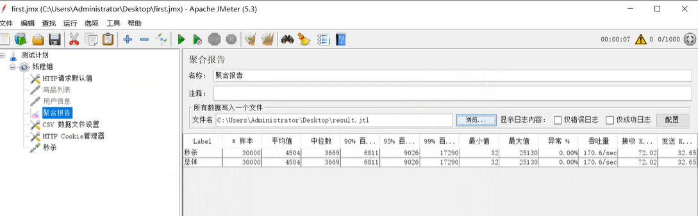

可以发现秒杀功能吞吐量很低，而且数据库也出现了超卖的情况。


## 九、页面缓存+URL缓存+对象缓存

> 页面优化缓存技术+资源静态化+前后端分离  https://blog.csdn.net/qq_36505948/article/details/82620908

### 1. 为什么使用页面缓存技术？

高并发场景的关键其实就在于对资源的节约，系统的瓶颈往往就来自于数据库，因此我们需要在不影响用户体验的情况下对一些静态页面或者变化不大的页面，使用缓存来减少对数据库的访问。

### 2. 页面缓存的思路？

首先一个页面是从后端提取数据后交给 SpringMVC或者SpringBoot进行渲染处理的，主要的页面消耗就是在渲染这一部分，因此我们需要在这之前进行拦截。(**主要是针对于依靠后端进行页面跳转和渲染的阶段**)

当客户端请求到达后端时，先到Redis中查询缓存，如果能够查到直接返回(缓存的是整个页面)。如果缓存查不到就进行数据库查询然后渲染，再存入缓存。**注意在Redis中缓存的页面需要设置一个超时时间**，缓存的时间根据页面进行调整。

项目中比如说查询商品列表的功能，由于所有用户查询到的商品列表页的数据都是一样的，那么每次访问`http://localhost:8080/goods/toList`接口时就不需要进行请求跳转到列表页然后渲染数据后返回，如果商品列表存在分页的情况，那么我们一般也只是缓存前几页的数据。

### 3. 前后端分离怎么进行页面缓存？

我认为主要依靠前端进行，由于前后端分离下页面的渲染是在前端进行的，那么对于不常变化的页面，前端可以做到路由切换时对部分组件进行缓存而不是销毁，这样就避免了重复渲染。

同时前端可以设置一个定时器，定时请求后端传递新数据，这样就实现了页面缓存的思想。

### 4. 代码(未前后端分离时的页面缓存)

```java
//用户查询商品列表

@RequestMapping(value = "/toList", produces = "text/html;charset=utf-8")
@ResponseBody
public String toList(Model model, User user,
                     HttpServletRequest request, HttpServletResponse response){
     //首先查询Redis缓存中是否有完整的缓存页面
     ValueOperations valueoperations = redisTemplate.opsForValue();
     String html = (String) valueoperations.get("goodList");
     //缓存中存在直接返回
     if(!StringUtils.isEmpty(html))
         return html;
     
     //缓存为空，手动渲染，存入Redis并返回
     //1.获取页面待渲染的数据
     model.addAttribute("user",user);
     model.addAttribute("goodsList",goodsService.findGoodsVo());
     //2.装载到WebContext中
     WebContext context = new WebContext(request,response,request.getServletContext(),model.asMap());
     //3.手动通过ThymeleafViewResolver视图解析器进行渲染
     html = thymeleafViewResolver.getTemplateEngine().process("goodsList",context);
     //将页面存储进入缓存
     valueoperations.set("goodList",html);
     if(html != null)
        return html;
}
```

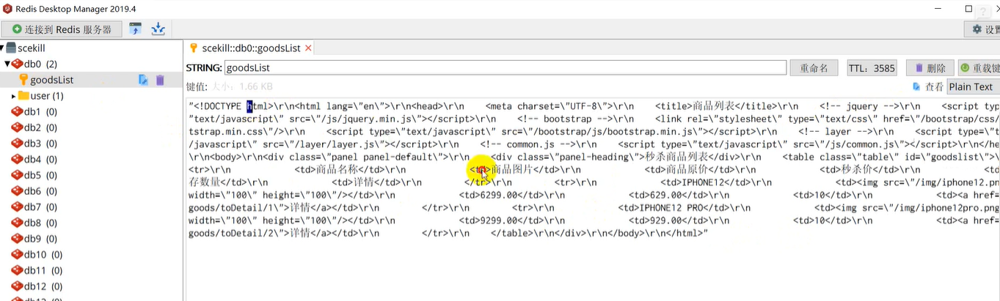

### 5. 对象缓存

相对比与页面缓存，对象缓存就是更细粒度的缓存+更新。注意更新时需要同时更新Redis+数据库。


## 十、页面静态化，前后端分离

将页面缓存到客户端的浏览器里，利用浏览器缓存页面，后端只传递给前端数据。

总的来说前后端分离就是使用了页面静态化的原理。


## 十一、静态资源优化

```properties
spring.resources.add-mappings = true                   //允许资源映射
spring.resources.cache-period = 3600                   //允许浏览器端的缓存时间
spring.resources.chain.cache = true                    //允许资源链式缓存
spring.resources.chain.enabled = true
spring.resources.chain.gzipped = true                  //允许资源压缩
spring.resources.chain.html-application-cache = true
spring.resources.static-locations = classpath:/static/
```

可以在SpringBoot中配置页面等相关资源来实现静态资源缓存到客户端。


## 十二、CDN优化

CDN的全称是 `Content Delivery Network`，即内容分发网络。基本思路是尽可能避开互联网上有可能影响传输速度和稳定性的瓶颈和环节，使得内容传输的更快、更稳定。通过在网络各处放置结点服务器所构成的现有的互联网基础之上的一层智能虚拟网络，CDN系统能够实时地根据网络流量和各节点地连接、负载状况以及到用户的距离和响应时间等综合信息将用户的请求重新导向离用户最近的服务节点上。


## 十三、缓存更新的套路

> https://blog.csdn.net/jiao_fuyou/article/details/52316348

### 1. 先更新数据库，然后再删除缓存(让缓存失效)

##### ① 为什么不是先删除缓存然后再更新数据库？

假设现在有两个并发操作，一个是读操作、一个更新操作。假设更新操作先删除了缓存，此时查询操作没有命中数据，那么查询操作会先到数据库中读取出老数据存储到缓存中，最后更新操作更新了数据库。这种情况下就会造成缓存中的数据是脏数据(老数据)，而且由于缓存不再是空，查询时一直能够命中，因此脏数据会一直脏下去。

##### ② 为什么不是更新数据库后更新缓存，而要去删除缓存？

> 参考回答： https://www.quora.com/Why-does-Facebook-use-delete-to-remove-the-key-value-pair-in-Memcached-instead-of-updating-the-Memcached-during-write-request-to-the-backend

假设现在有两个更新操作，操作1先对数据库进行了更新，还没来得及更新缓存，此时操作2却执行完了更新数据库+更新缓存的操作，最后轮到操作1去更新缓存。

造成的结果就是数据库和缓存中的值不一致。

##### ③ 正确的逻辑：Cache Aside Pattern

最常用的更新逻辑

* **失效：**应用程序先从cache中取数据，没有取到，则从数据库中取数据，成功后放到缓存中；
* **命中：**应用程序从 cache 中取数据，取到数据后返回；
* **更新：**先把数据存到数据库中，然后让缓存失效；

这种为什么就没有问题了呢？

​        假设还是一个读操作、一个更新操作，更新操作先对数据库进行了更新，此时没有删除缓存，那么读操作能够命中，只不过读出来的是旧数据(因为现在更新操作也没有完成)，之后更新操作完成了更新，相应的会去删除缓存，如果现在再有读操作执行，会从数据库读取最新的操作然后存储到缓存中。这样一来，缓存中存储的永远是最新的数据。

##### ④ 这种逻辑有没有问题？

实际上也有待完善的地方，比如说现在一个读操作、一个更新操作，读操作先执行但是没有命中接着回去查询数据库；此时更新操作执行了，成功完成了更新然后删除了缓存；最后读操作将读取的结果存储到了缓存中。这样造成的结果就是缓存中存储的永远是旧数据。

但是这种情况发生的概率是很低的，因为这种情况发生的条件是读操作先于写操作进入，晚于写操作退出。而实际上读操作会比写操作快的多，写操作会用到行锁或者表锁耗费的时间更长。